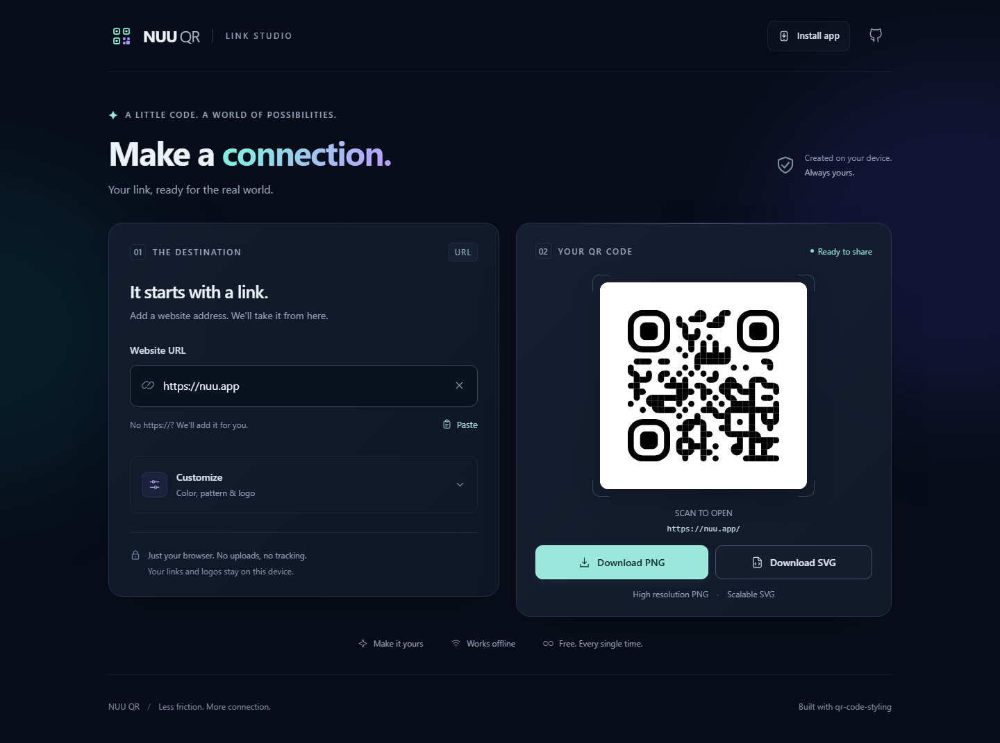
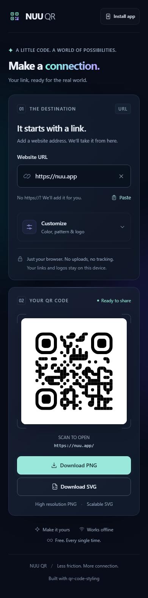

# NUU QR

**A little code. A world of possibilities.**

An English-language, mobile-friendly QR code studio. Turn a website address into a crisp, customizable QR code, entirely in your browser.

**Production URL:** [root50643.github.io/qrcode-generator](https://root50643.github.io/qrcode-generator/) · **Hosting:** GitHub Pages



<details>
<summary>See the mobile interface</summary>
<br />

</details>

## Features

- Instant QR previews from HTTP or HTTPS website URLs. Missing `https://` is added automatically.
- One-click clipboard paste, with a manual-paste fallback when browser access is unavailable.
- Extra-rounded black-on-white defaults with rounded finder corners, custom foreground colors, and six dot patterns.
- Local PNG, JPEG, or WebP logos, up to 5 MB. Higher error correction is applied when a logo is used.
- Download a **1024 × 1024 PNG** or a **self-contained SVG**, including the logo and a four-module quiet zone.
- Responsive dark interface, keyboard navigation, visible focus, and reduced-motion support.
- Installable PWA with offline creation and downloads after the first successful online visit.
- Updates are offered explicitly; accepting an update preserves the current design.

## Use it

1. Enter a **Website URL**, or click **Paste**.
2. Open **Customize** to choose a color, dot pattern, or logo.
3. Select **Download PNG** for a bitmap or **Download SVG** for a scalable image.

Use **Clear** to remove the URL, or **Reset appearance** to return to the black **Extra rounded** style without changing the URL. Dark colors provide the best scanning results. Test your final QR code with a phone before printing it, especially when using a custom logo.

The URL is encoded directly: there are no short links, redirects, accounts, or usage limits. Generating a code does not contact the destination website. Chinese and other Unicode URLs are serialized correctly before encoding.

## Install and use offline

Open the site online once and wait for the offline-ready notification. In a supported browser, click **Install app** or use the browser's installation menu. On iPhone or iPad, open the site in Safari and choose **Share → Add to Home Screen**.

After the application assets are cached, you can open it and create or download QR codes without a network connection. The website encoded in a QR code may still need internet access when someone scans it. Installation controls vary by browser; clipboard reading and service workers require HTTPS, except on localhost.

## Privacy

QR codes and uploaded logos are processed on your device. This application has no backend, analytics, cookies, or saved URL history. Its scripts, icons, and styles are served together; it does not load a third-party CDN or font service.

Only when you explicitly accept an app update is the current edit temporarily stored in `sessionStorage`. It is restored and removed after reloading, and expires after ten minutes. This includes the URL, appearance, and logo. GitHub Pages still receives ordinary requests for the website's static files.

## Develop

Use **Node.js 24** and npm.

```sh
npm ci
npm run dev
```

```sh
npm run typecheck
npm test
npm run build
npm run preview
```

The production site is generated in `dist/`. Service workers are disabled in the development server; use the production preview to test offline behavior.

Run the browser tests against a production build:

```sh
npx playwright install chromium
npm run build
npm run test:e2e
```

The tests independently decode exported PNG and SVG images, check styles and logos, exercise URL/clipboard errors, verify offline reopening, and inspect mobile/desktop layouts. PWA update behavior is covered by unit tests.

To regenerate the actual README screenshots, run the browser suite with the `UPDATE_SCREENSHOTS=1` environment variable. On PowerShell:

```powershell
$env:UPDATE_SCREENSHOTS = '1'
npm run test:e2e -- --grep 'captures actual'
Remove-Item Env:UPDATE_SCREENSHOTS
```

## Project layout

```text
src/                    Application UI, QR adapters, and PWA behavior
public/                 Original app icons and static assets
vendor/qr-code-styling/  Pinned source, upstream license, and patch notes
tests/unit/             URL normalization and PWA update tests
tests/e2e/              Browser, export, decoding, and offline tests
docs/images/            Real desktop and mobile screenshots
scripts/                Reproducible app-icon generation
.github/workflows/      Checks and GitHub Pages deployment
```

## Deploy to GitHub Pages

In the repository's **Settings → Pages**, choose **GitHub Actions** as the build source. Pushing to `main` runs unit tests, type checking, production build, and Chromium browser tests before publishing `dist/`. Pull requests run the checks without deploying.

The workflow reads `actions/configure-pages` output and supplies `BASE_PATH` to Vite. Assets, the manifest, and the service worker use `/qrcode-generator/` for the production project URL. Local builds default to `/`; set `BASE_PATH=/qrcode-generator/` to reproduce the production build.

The site uses GitHub's default HTTPS address, **https://root50643.github.io/qrcode-generator/**. Leave **Custom domain** empty in **Settings → Pages** and keep **Enforce HTTPS** enabled. No custom domain or DNS configuration is required.

## Source and license

The application uses the specifically requested [oblakstudio/qr-code-styling](https://github.com/oblakstudio/qr-code-styling) fork, pinned to commit `29fc080550e3dc1146c50a4d0838f4a3a3ccb87b`. Its source is bundled locally because that fork's scoped package is distributed through GitHub Packages; the unscoped npm package in the upstream README is a different distribution.

The only runtime npm dependency is `qrcode-generator@1.4.4`. No Node canvas, DOM emulation, or Node polyfills are shipped to the browser. See [vendor provenance and patches](vendor/qr-code-styling/README.md).

NUU QR is available under the [MIT License](LICENSE). The vendored renderer retains its [upstream MIT license](vendor/qr-code-styling/LICENSE).
